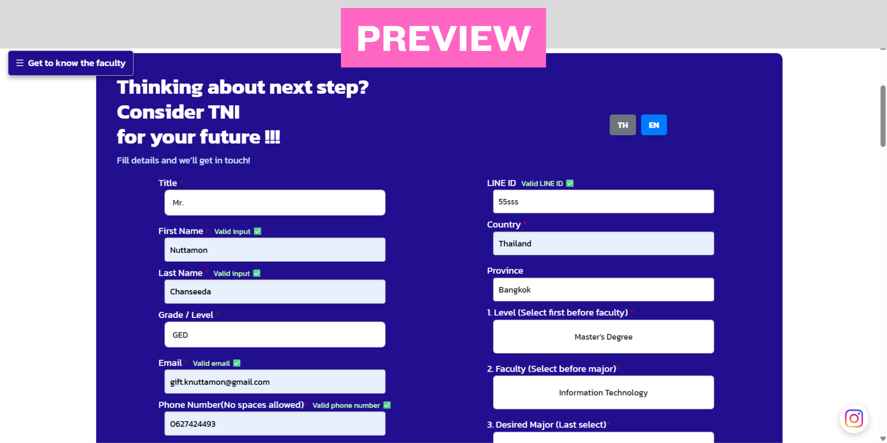
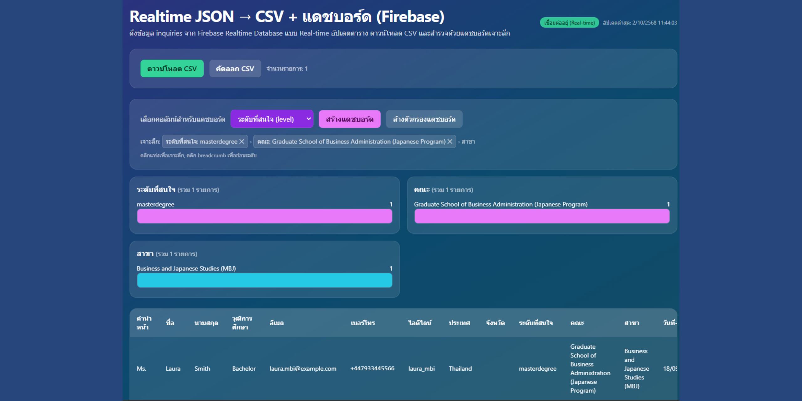

# 📊 TNI Reach – Data Dashboard & Realtime CSV

> 🔎 Realtime data management system for prospective student interest at Thai-Nichi Institute of Technology (TNI)  
> Built with **Firebase Realtime Database, Bootstrap 5 CSS, JavaScript** and deployed via **Github Hosting**

## 🌟 Features
- Realtime data fetching from **Firebase Realtime Database**  
- Export prospective student interest data as **CSV / Copy to clipboard**  
- Interactive **dashboard** with drill-down filtering (Level → Faculty → Major, Country → Province, etc.)  
- Responsive design with **Bootstrap 5 CSS**  
- Data table with sticky headers, timestamp formatting, and phone number safety handling for Excel  

---

## 🚀 Usage
1. Admin connects to the TNI Realtime Database  
2. Student inquiries auto-update in the table  
3. Export data as CSV (UTF-8 with BOM, supports Thai characters)  
4. Explore analytics dashboard with bar charts and drill-down  

---

## 🛠 Tech Stack
- **Frontend:** HTML5, CSS3, Bootstrap 5 CSS  
- **Database:** Firebase Realtime Database  
- **Logic:** JavaScript (ES6, Firebase Modular SDK v9+)  
- **Hosting:** Github Hosting  

---

## 📸 Preview

---

## 📌 About the Project
This project was developed as part of **Computer Engineering Co-operative Education (TNI)** to support TNI’s **Admissions & Marketing team**.  
It automates the process of **collecting, managing, and analyzing prospective student interest data** from multiple campaigns and platforms (Facebook, Instagram, TikTok, YouTube, etc.).  

---

## ❤️ Credits
Developed by **Nuttamon Chanseeda (Gift)** – Computer Engineering, TNI  
